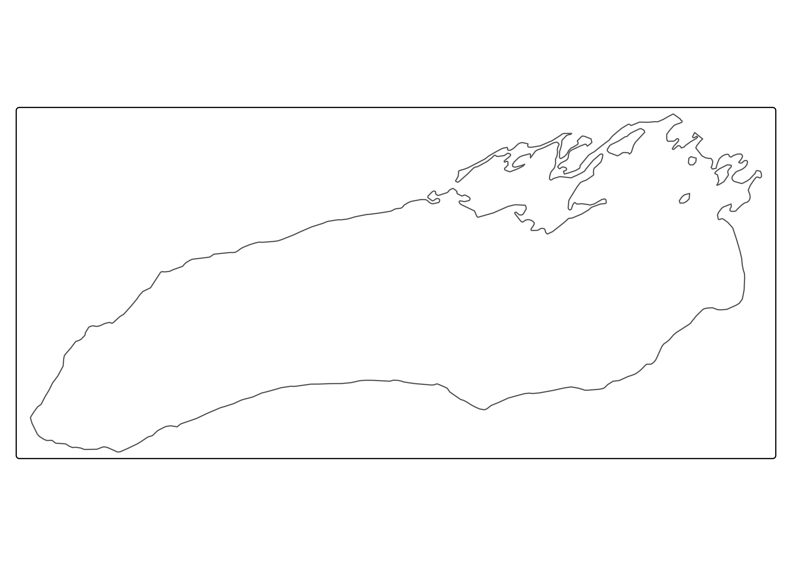
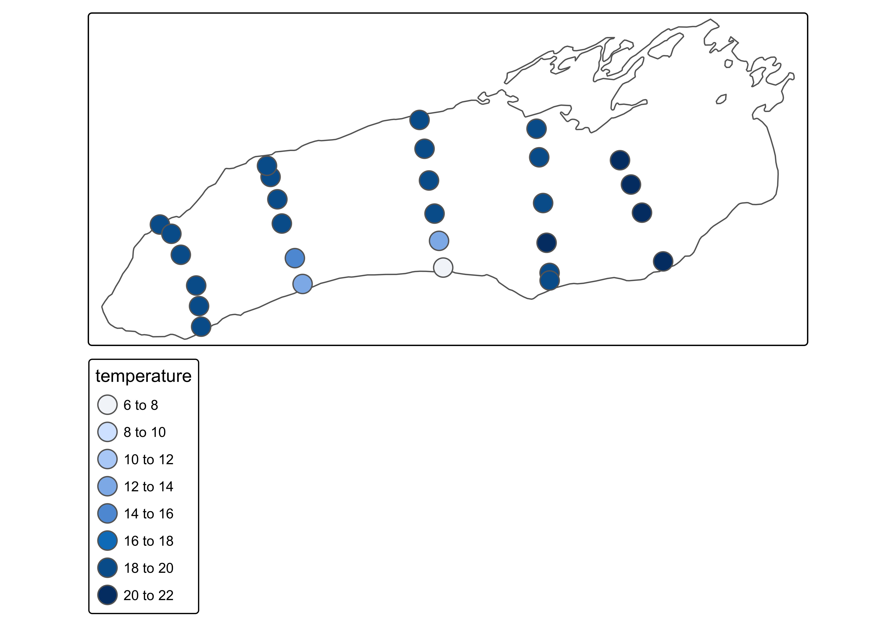
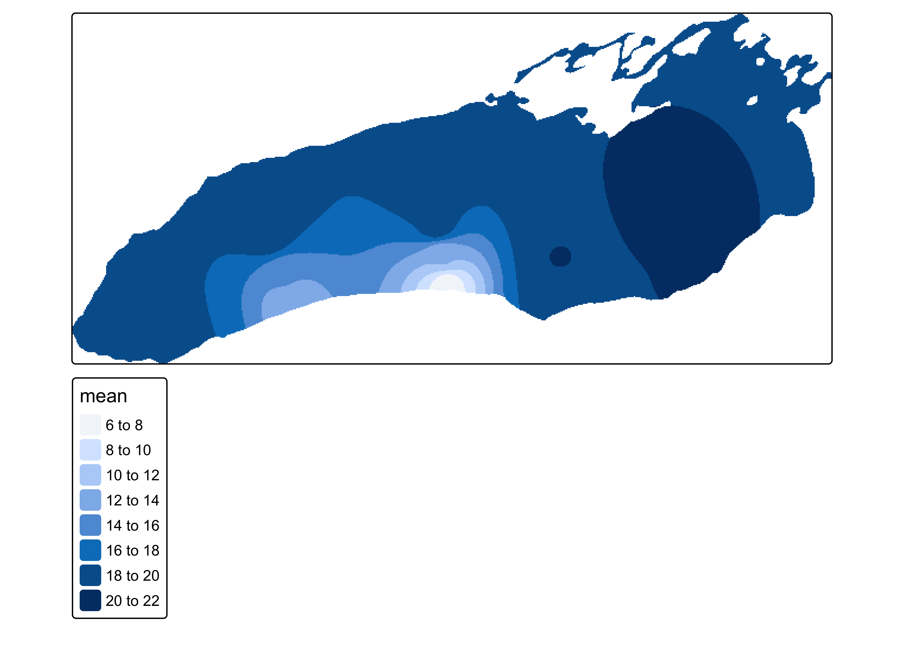
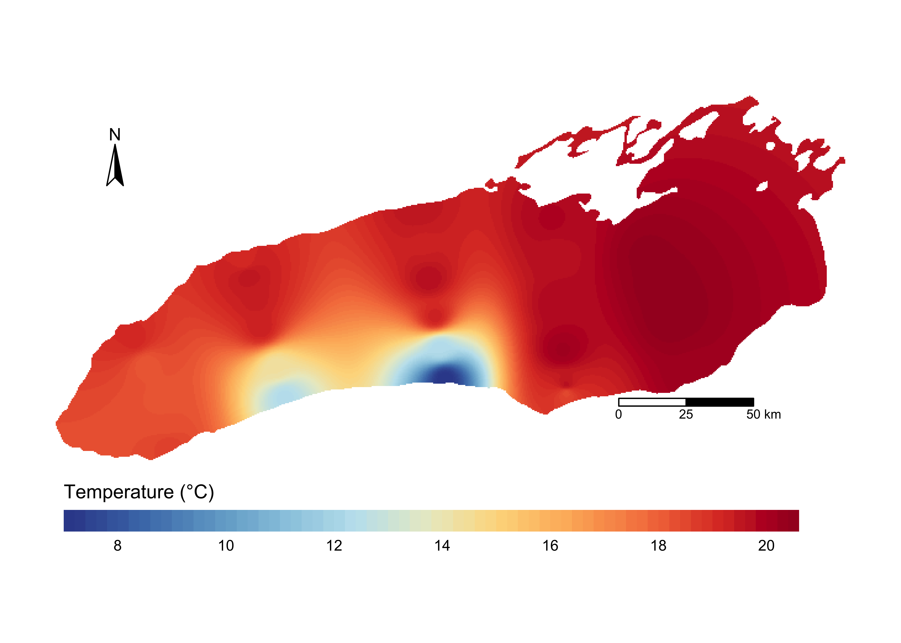

## Purpose of Document

In our Great Lakes work, we often want to spatially interpolate variables across the lake. Here, I show one approach to doing this, using distance-weighted interpolation from the `gstat` package.

## Installing and Loading Packages and Data

First, we need to install and load packages. Note that some versions **do** matter in this case, as `tmap` is undergoing breaking changes as it transitions to v4. Also, if you're a Mac or Linux user, you may need to separately install the `PROJ`, `GDAL` and/or `GEOS` software. I recommend you do this using homebrew.


::: {.cell layout-align="center"}

```{.r .cell-code}
# install.packages("tidyverse")
# install.packages("sf")
# install.packages("terra")
# install.packages("gstat")
# install.packages("remotes")
# install.packages("pacman")
# remotes::install_github("r-tmap/tmap")
# remotes::install_github("mtennekes/tmaptools")

pacman::p_load(tidyverse,
               sf,
               terra,
               gstat,
               tmap,
               tmaptools,
               install = FALSE)
```
:::


Next, we'll load our data objects. First, we have an outline of Lake Ontario, which I downloaded from the USGS. We'll also project it to a Great Lakes specific projection.


::: {.cell layout-align="center"}

```{.r .cell-code}
ont_outline <- read_sf("data/ontario_outline/hydro_p_LakeOntario.shp")

proj_outline <- ont_outline %>%
                    st_transform(crs = "EPSG:3174") %>%
  st_union()

tm_shape(proj_outline) + 
  tm_borders()
```

::: {.cell-output-display}
{fig-align='center' width=2100}
:::
:::


Beautiful. Next, we'll load in our data to plot. In this case, it's a csv file which contains temperature measurements for stations across Lake Ontario, collected by the EPA on the September 2023 CSMI cruise.


::: {.cell layout-align="center"}

```{.r .cell-code}
temp_df <- read_csv("data/temp_measurements.csv")

glimpse(temp_df)
```

::: {.cell-output .cell-output-stdout}
```
Rows: 28
Columns: 4
$ Station_ID  <dbl> 8, 9, 12, 17, 18, 19, 27, 28, 29, 33, 34, 35, 38, 39, 40, …
$ temperature <dbl> 18.9786, 19.0417, 18.0735, 18.4766, 18.1505, 18.1145, 19.2…
$ latitude    <dbl> 43.62317, 43.58533, 43.50333, 43.22533, 43.30400, 43.38283…
$ longitude   <dbl> -79.45317, -79.39617, -79.35367, -79.27167, -79.27567, -79…
```
:::

```{.r .cell-code}
temp_sf <- temp_df %>%
  st_as_sf(coords = c("longitude","latitude"), crs = "EPSG:4326") %>%
  st_transform(crs = "EPSG:3174")

tm_shape(proj_outline) + 
  tm_borders() + 
  tm_shape(temp_sf) + 
  tm_symbols(fill = "temperature")
```

::: {.cell-output-display}
{fig-align='center' width=2100}
:::
:::


Okay! That's looking good. Let's move on to interpolation.

## Interpolation

Now, we can assume that surface temperature is a continuous variable, and it's generally reasonable to assume that we can interpolate temperatures between stations. This means that our end goal is to go from *vector* data (discrete points) to *raster* data (continuous data defined by the fill of a grid). What we're essentially going to do is use our point measurements to create a function that predicts temperature across a 2D grid. In order to do that, we'll first define a the resolution and spatial extent of the grid, and then map our values across it.

First, let's define our grid.


::: {.cell layout-align="center"}

```{.r .cell-code}
# Create an empty raster from our ontario outline
# We'll first need to simplify our outline to an sf, not sfc
outline_sf <- st_sf(proj_outline)

grid <- rast(outline_sf, nrows = 320, ncols = 640)

tm_shape(grid) + 
  tm_raster()
```

::: {.cell-output-display}
{fig-align='center' width=2100}
:::
:::


Thrilling - we have an empty raster. Changing the nrows and ncols will change the resolution of that grid, which will affect how "smooth" your raster looks at the end. However, higher-resolution grids will take longer to calculate.

In the enxt step, we'll use a spatial model (defined by gstat) to predict the values of a variable at specified locations. Crucially, we can't feed this model a raster grid; rather, it accepts vector points. As such, we need to extract the midpoint of each raster grid cell as a point, and coerce it to an sf object. We'll also filter it such that we only predict values within our Lake Ontario outline.


::: {.cell layout-align="center"}

```{.r .cell-code}
# Extract mid points
xy <- xyFromCell(grid, 1:ncell(grid))

# Coerce to project point geometry
points_to_predict <- xy %>%
                        as.data.frame(xy) %>%
                        st_as_sf(coords = c("x","y"),
                                 crs = "EPSG:3174") %>%
                        st_filter(proj_outline) # Filter to be within Lake Ontario
```
:::


Now that we've prepped those, we can move to interpolation. First, we build the model, which describes temperature over space, and then we predict the temperature for each of our `points_to_predict`. This is similar to using `lm` to build a linear model, and then using predict to calculate new values in a dataframe.

The crucial tuning parameter here is `idp`, which affects how quickly our temperature prediction decays towards the mean as you travel away from a measure point. This is worth playing around with to achieve a rational-looking map.


::: {.cell layout-align="center"}

```{.r .cell-code}
# Build the model
ip_model <- gstat(formula = temperature ~ 1, 
                  locations = temp_sf, 
                  nmax = nrow(temp_sf), 
                  set = list(idp = 3))

# Predict temps
temp_preds <- predict(ip_model, points_to_predict) %>% 
  vect() # Needed to work in terra
```

::: {.cell-output .cell-output-stdout}
```
[inverse distance weighted interpolation]
```
:::

```{.r .cell-code}
# Convert points to a raster  
output_raster <- terra::rasterize(temp_preds, grid, field = "var1.pred", fun = "mean")

# Check our new raster
tm_shape(output_raster) + 
  tm_raster()
```

::: {.cell-output-display}
{fig-align='center' width=2100}
:::
:::


Wow! We just made an interpolated raster of our data. Let's clean up the plotting so we finish with a beautiful map.


::: {.cell layout-align="center"}

```{.r .cell-code}
tm_shape(output_raster) + 
  tm_raster(col.scale = tm_scale_continuous(values = "tol.sunset"),
            col.legend = tm_legend(title = "Temperature (°C)",
                                   orientation = "landscape",
                                   frame = FALSE)) + 
  tm_layout(frame = FALSE) + 
  tm_compass(position = tm_pos_auto_in()) + 
  tm_scalebar(breaks = c(0,25, 50), position = c(.7,0.2), text.size = .6)
```

::: {.cell-output-display}
{fig-align='center' width=2100}
:::
:::


Looks good! I hope you enjoyed the tutorial.


::: {.cell layout-align="center"}

```{.r .cell-code}
sessionInfo()
```

::: {.cell-output .cell-output-stdout}
```
R version 4.3.2 (2023-10-31)
Platform: aarch64-apple-darwin20 (64-bit)
Running under: macOS Sonoma 14.5

Matrix products: default
BLAS:   /Library/Frameworks/R.framework/Versions/4.3-arm64/Resources/lib/libRblas.0.dylib 
LAPACK: /Library/Frameworks/R.framework/Versions/4.3-arm64/Resources/lib/libRlapack.dylib;  LAPACK version 3.11.0

locale:
[1] en_US.UTF-8/en_US.UTF-8/en_US.UTF-8/C/en_US.UTF-8/en_US.UTF-8

time zone: America/New_York
tzcode source: internal

attached base packages:
[1] stats     graphics  grDevices utils     datasets  methods   base     

other attached packages:
 [1] tmaptools_3.1-1 tmap_3.99.9000  gstat_2.1-1     terra_1.7-71   
 [5] sf_1.0-14       lubridate_1.9.3 forcats_1.0.0   stringr_1.5.1  
 [9] dplyr_1.1.4     purrr_1.0.2     readr_2.1.4     tidyr_1.3.0    
[13] tibble_3.2.1    ggplot2_3.5.0   tidyverse_2.0.0

loaded via a namespace (and not attached):
 [1] tidyselect_1.2.0   viridisLite_0.4.2  fastmap_1.1.1      leaflegend_1.2.0  
 [5] leaflet_2.2.1      pacman_0.5.1       XML_3.99-0.15      digest_0.6.33     
 [9] timechange_0.2.0   lifecycle_1.0.4    magrittr_2.0.3     compiler_4.3.2    
[13] rlang_1.1.2        tools_4.3.2        utf8_1.2.4         yaml_2.3.8        
[17] data.table_1.14.10 knitr_1.45         FNN_1.1.4          htmlwidgets_1.6.3 
[21] bit_4.0.5          sp_2.1-1           classInt_0.4-10    RColorBrewer_1.1-3
[25] abind_1.4-5        KernSmooth_2.23-22 withr_2.5.2        leafsync_0.1.0    
[29] grid_4.3.2         fansi_1.0.6        xts_0.13.2         cols4all_0.7      
[33] e1071_1.7-13       leafem_0.2.3       colorspace_2.1-0   scales_1.3.0      
[37] dichromat_2.0-0.1  cli_3.6.2          crayon_1.5.2       rmarkdown_2.25    
[41] intervals_0.15.4   generics_0.1.3     rstudioapi_0.15.0  tzdb_0.4.0        
[45] DBI_1.2.2          proxy_0.4-27       stars_0.6-4        parallel_4.3.2    
[49] base64enc_0.1-3    vctrs_0.6.5        jsonlite_1.8.8     hms_1.1.3         
[53] bit64_4.0.5        crosstalk_1.2.1    units_0.8-5        glue_1.6.2        
[57] lwgeom_0.2-13      codetools_0.2-19   stringi_1.8.3      gtable_0.3.4      
[61] raster_3.6-26      munsell_0.5.0      pillar_1.9.0       htmltools_0.5.7   
[65] R6_2.5.1           vroom_1.6.5        evaluate_0.23      lattice_0.21-9    
[69] png_0.1-8          class_7.3-22       Rcpp_1.0.11        widgetframe_0.3.1 
[73] spacetime_1.3-1    xfun_0.41          zoo_1.8-12         pkgconfig_2.0.3   
```
:::
:::
